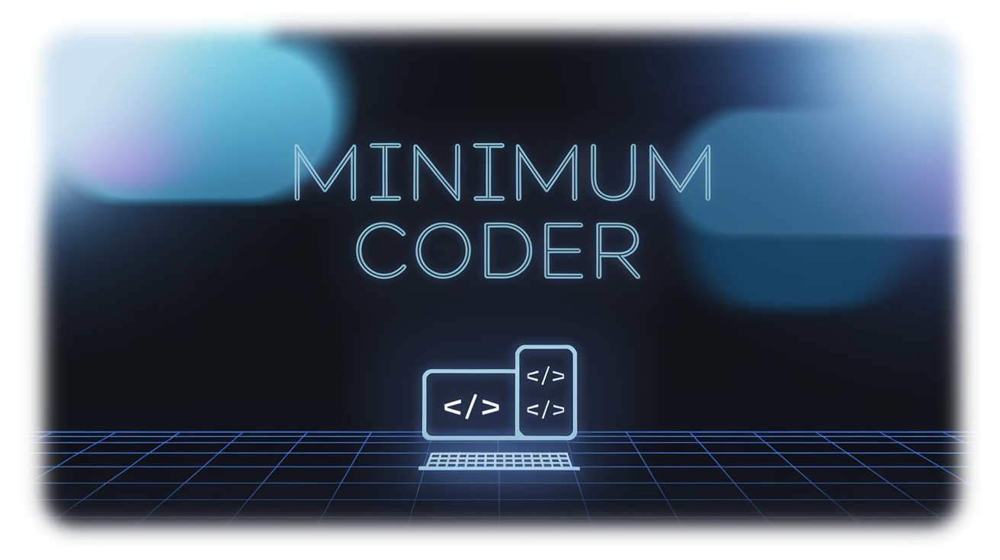

<p align="center">
  
</p>

<h1 align="center">🌟 Minimum Coder</h1>

<p align="center">
  <a href="https://github.com/coder/coder/blob/main/LICENSE">
    
  </a>
  <a href="https://github.com/Sunwood-ai-labs/minimum-coder/stargazers">
    
  </a>
  <a href="https://github.com/Sunwood-ai-labs/minimum-coder/issues">
    
  </a>
</p>

<p align="center">
  
  
  
  
</p>

これは[Coder](https://github.com/coder/coder)の最小構成版です。リモート開発環境を簡単にセットアップし、どこからでも開発作業が行えるようにする軽量なソリューションです。

## 💡 概要

Minimum Coderは以下の機能を提供する最小限のセットアップを実現しています：

- 🔨 任意のクラウドでの開発環境構築
- 💻 主要なIDEサポート（VS Code、JetBrains等）
- 🔒 セキュアなリモートアクセス
- 🚀 高速な開発環境
- 🎯 カスタマイズ可能なワークスペーステンプレート

## ⚙️ 動作環境

- Docker
- Docker Compose
- Terraform

## 📦 インストール

1. このリポジトリをクローン：
```bash
git clone https://github.com/yourusername/minimum-coder.git
cd minimum-coder
```

2. 環境の起動：
```bash
docker-compose up -d
```

3. Terraformテンプレートの設定：
```bash
# Dockerテンプレートを作成
coder templates create docker --directory templates/docker
```

## 🚀 使用方法

1. ワークスペースの作成：
```bash
coder create --template docker my-workspace
```

2. ブラウザで開発環境にアクセス：
```
http://localhost:7080
```

3. お好みのIDEを使用して開発を開始

## 🔧 設定

### Docker Compose設定
設定は`docker-compose.yaml`で管理されています：
- ポート設定（デフォルト: 7080）
- データベース設定
- ボリューム設定

### ワークスペーステンプレート
`templates`ディレクトリには以下のテンプレートが用意されています：

#### 🐳 Dockerテンプレート (`templates/docker`)
- 基本的な開発環境の構築
- VS Code拡張機能の自動インストール
  - Python、Go、Docker、Terraform等
- リソースモニタリング機能
- Git設定の自動化

詳細な設定方法は各テンプレートのREADMEを参照してください。

## 🔐 セキュリティ設定

Webviewを使用する拡張機能（Roo Clineなど）を使用する場合は、追加のセキュリティ設定が必要です。

本番環境向けの設定方法と開発環境向けの簡易設定方法について、[セキュリティドキュメント](docs/security-docs.md)で詳しく説明しています。

## 🤝 貢献

プルリクエストやイシューの報告を歓迎します。大きな変更を加える場合は、まずイシューで変更内容を議論してください。

## 📝 ライセンス

このプロジェクトは[GNU Affero General Public License v3.0](https://github.com/coder/coder/blob/main/LICENSE)の下で公開されています。

## 📚 参考リンク

- [Coder公式ドキュメント](https://coder.com/docs/coder-oss)
- [Coder GitHub](https://github.com/coder/coder)
